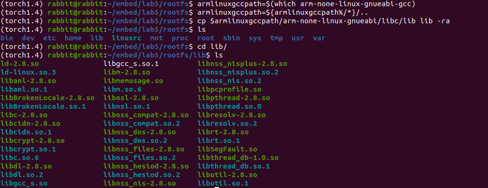

# 嵌入式系统设计方法—— Lab5
PB18111697 王章瀚

---

## 编译安装 busybox
- busybox 版本: 1.22.0

### 遇到问题及解决方案

#### RLIMIT_FSIZE undeclared
如下图所示:


[解决方案](https://blog.csdn.net/zouli415/article/details/89406778)

就是在 `libbb.h` 加一句
```c
#include "sys/resource.h"
```

#### 
2. 
[解决方案]()
3. rdate 
解决方案: 干脆不要勾选:
    - Coreutils/date:
        
    - Linux System Utilities/rdate
        


至此 busybox 编译安装完成 

## 构建根文件系统

1. 创建所需目录:

```shell
mkdir  dev  etc  home  lib   mnt  proc  root   sys  tmp   var -p
```

2. 在创建的根文件系统的 etc目录下创建inittab文件：
```shell
touch etc/inittab
vim etc/inittab
```

写入
```txt
#this is run first except when booting in single-user mode.
::sysinit:/etc/init.d/rcS
# /bin/sh invocations on selected ttys
::respawn:-/bin/sh
# Start an "askfirst" shell on the console (whatever that may be)
::askfirst:-/bin/sh
# Stuff to do when restarting the init process
::restart:/sbin/init
# Stuff to do before rebooting
::ctrlaltdel:/sbin/reboot
::shutdown:/sbin/swapoff -a
```

3. 构建 `init.d` 及其内容
```shell
mkdir etc/init.d/ -p
touch etc/init.d/rcS
vim etc/init.d/rcS
```

写入:
```shell
#!/bin/sh
#This is the first script called by init process
/bin/mount -a
echo /sbin/mdev>/proc/sys/kernel/hotplug
mdev -s
```

4. 构建 `fstab` 及其内容

```shell
touch etc/fstab
vim etc/fstab
```

```txt
#device     mount-point     type         options       dump     fsck order
proc        /proc           proc         defaults        0        0
tmpfs       /tmp            tmpfs        defaults        0        0
sysfs       /sys            sysfs        defaults        0        0
tmpfs       /dev            tmpfs        defaults        0        0
```

5. 创建 `profile` 文件

```shell
touch etc/profile 
vim etc/profile
```

```shell
#!/bin/sh
export HOSTNAME=pb18111697
export USER=root
export HOME=root
export PS1="[$USER@$HOSTNAME \W]\# "
#export PS1="[\[\033[01;32m\]$USER@\[\033[00m\]\[\033[01;34m\]$HOSTNAME\[\033[00m\ \W]\$ "
PATH=/bin:/sbin:/usr/bin:/usr/sbin
LD_LIBRARY_PATH=/lib:/usr/lib:$LD_LIBRARY_PATH
export PATH LD_LIBRARY_PATH
```

6. 添加动态库支持

查找位置:
```shell
armlinuxgccpath=$(which arm-none-linux-gnueabi-gcc)
armlinuxgccpath=${armlinuxgccpath%/*}/..
cp $armlinuxgccpath/arm-none-linux-gnueabi/libc/lib lib -ra
```



---

## 创建镜像 image 文件

使用飞凌官方提供的 `mkyaffs2image-nand2g` 来生成. 见如下命令:
```shell
mkyaffs2image-nand2g rootfs rootfs.yaffs2
```

其中 `rootfs` 是刚才所生成的根文件系统的路径, `rootfs.yaffs2` 是生成的文件名.

---

## 烧写

烧写过程和第一次实验无异,
1. 开启 sd 卡启动模式
2. 烧写
3. 开启 nand 启动模式
4. 打开设备

---

## 启动系统并测试

### 遇到问题及解决方案

遇到了一个问题: `modprobe` 的地方有点问题, 如下:

我尝试取消勾选 `modprobe`, 但毫无效果.

查阅了 [参考资料](https://blog.csdn.net/weixin_34367257/article/details/92148686), 在 `busybox` 中配置交叉编译的 `prefix` 后才成功.


---

## 测试

成功启动后, 
1. 首先可以看到主机名是我设置了的 `pb18111697`
2. 然后执行我提前放入的 `HelloWorld`, 结果如期.
    

---

## 实验总结

本次实验让我学会了如何构建, 生成, 并烧写一个根文件系统, 收获颇丰.